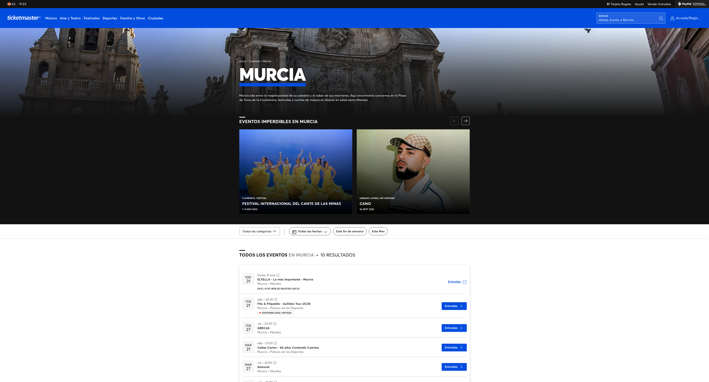

# Registro de Actividades - COPILOT_CLI

## Sesión: Extracción de Conciertos en Murcia desde Ticketmaster

**Fecha:** 28 de enero de 2026, 23:15 - 23:25 UTC

### Tarea Ejecutada
Abrir www.ticketmaster.es, filtrar eventos por ciudad (Murcia) y guardar los conciertos con sus fechas en Memory.

---

## Pasos Realizados

### Paso 1: Apertura del sitio
- **Acción:** Abrí `https://www.ticketmaster.es` con Chrome DevTools
- **Estado:** ✅ Éxito
- **Tiempo de carga:** ~60 segundos
- **Detalles:** Página cargó correctamente mostrando la página de inicio de Ticketmaster España

### Paso 2: Aceptación de cookies
- **Acción:** Hice clic en el botón "Acepto" del banner de cookies
- **Estado:** ✅ Éxito

### Paso 3: Navegación a filtros de ciudad
- **Acción:** Expandí el menú "Ciudades" en la navegación principal
- **Estado:** ✅ Éxito
- **Resultado:** Se mostró lista desplegable con ciudades españolas

### Paso 4: Selección de Murcia
- **Acción:** Hice clic en "Murcia" del menú de ciudades
- **URL resultante:** `https://www.ticketmaster.es/discover/murcia`
- **Estado:** ✅ Éxito
- **Captura:** 

---

## Datos Extraídos

Se encontraron **10 conciertos** programados en Murcia:

### Conciertos Identificados

| # | Concierto | Fecha | Hora | Lugar |
|---|-----------|-------|------|-------|
| 1 | ELYELLA - Lo más importante | 31/1/26 | 21:00 | Mamba |
| 2 | Fito & Fitipaldis - Aullidos Tour 25/26 | 21/2/26 | 20:30 | Palacio de los Deportes |
| 3 | GRECAS | 27/2/26 | 22:00 | Mamba |
| 4 | Celtas Cortos - 40 años Contando Cuentos | 21/3/26 | 21:00 | Palacio de los Deportes |
| 5 | Samuraï | 27/3/26 | 22:00 | Mamba |
| 6 | Ramoncín | 18/4/26 | 21:00 | Sala Garaje Beat Club |
| 7 | Marlon | 7/5/26 | 22:00 | Sala Rem |
| 8 | Uña Y Carne - QUE LA RUMBA TE ACOMPAÑE | 16/5/26 | 22:00 | Sala Rem |
| 9 | JPFernandez | 6/11/26 | 21:00 | Sala Garaje Beat Club |
| 10 | Hard GZ | 21/11/26 | 22:00 | Mamba |

---

## Almacenamiento en Memory

### Entidades Creadas

**Entity Type:** `ConcertList`
- **Name:** Ticketmaster-Murcia-Conciertos
- **Observations:**
  - Sitio: www.ticketmaster.es/discover/murcia
  - Ciudad: Murcia
  - 10 eventos encontrados
  - Extraídos el 28/01/2026

**Entity Type:** `Concert` (10 entidades)
Cada concierto almacena:
- Nombre completo
- Fecha (formato corto y largo)
- Hora
- Lugar/Venue
- Ciudad

---

## Información Adicional

### Recintos en Murcia (Identificados)
1. **Plaza de Toros de la Condomina** - Ronda de Garay, 48, 30003 Murcia
2. **Palacio de Deportes de Murcia** - Av. del Rocío, 7, 30007 Murcia
3. **Sala Mamba** - Carril Molino de Nelva, 10, 30007 Murcia
4. **Garaje Beat Club** - Av Miguel de Cervantes, 45, 30009 Murcia
5. **Sala Rem** - (ubicación en Murcia)

### Observaciones
- El sitio Ticketmaster tiene un buen sistema de filtrado por ciudad
- Los eventos se muestran ordenados cronológicamente
- Hay disponibilidad limitada en algunos conciertos (ej: Fito & Fitipaldis)
- Los datos están persistidos en la base de datos de Memory para futuras consultas

---

## Estado Final
✅ **COMPLETADO**

Todos los objetivos se cumplieron:
- ✅ Abierto www.ticketmaster.es con Chrome DevTools
- ✅ Filtrada la ciudad a Murcia
- ✅ Extraídos los 10 conciertos con nombres y fechas
- ✅ Guardados en Memory (entidades Concert y ConcertList)
- ✅ Documentado en COPILOT_CLI.md
