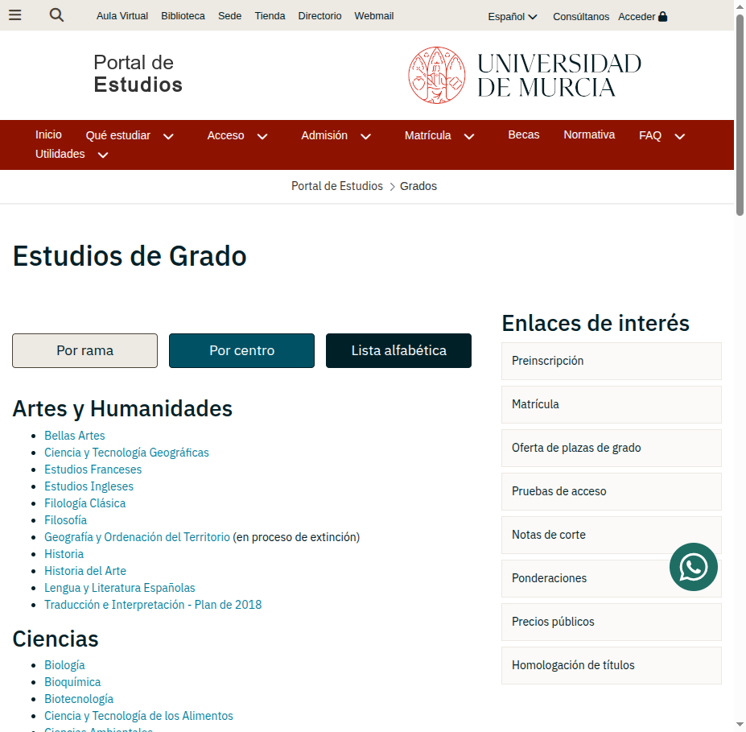
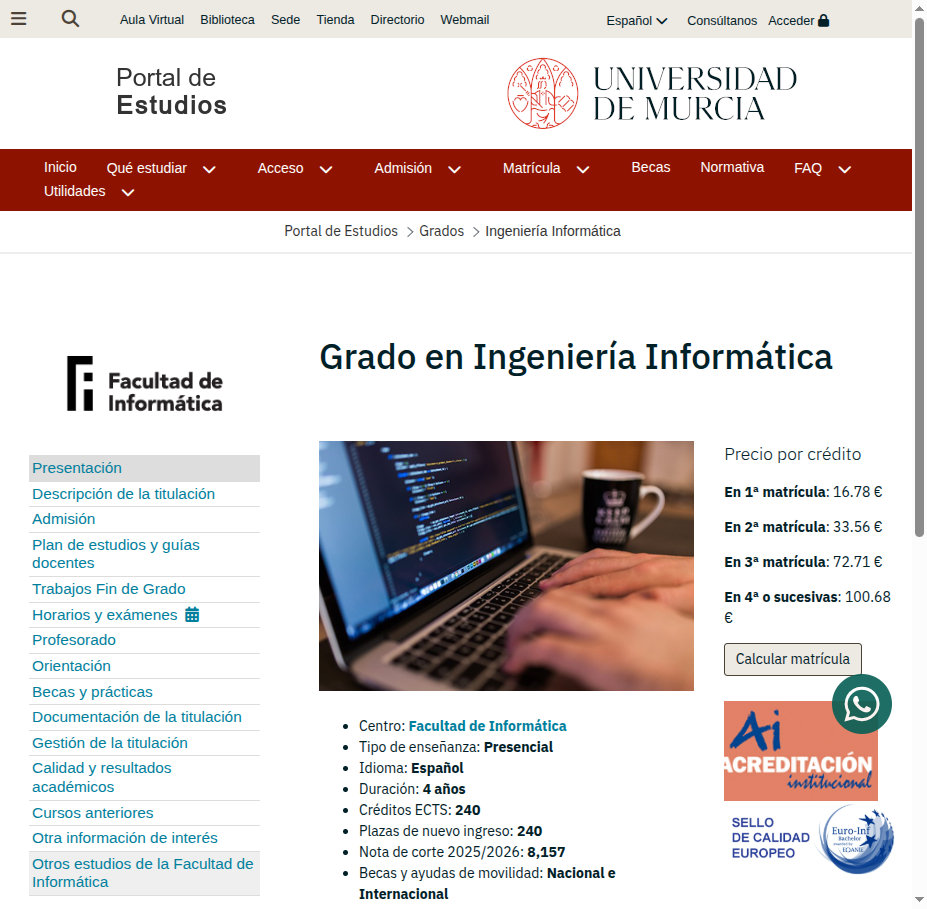
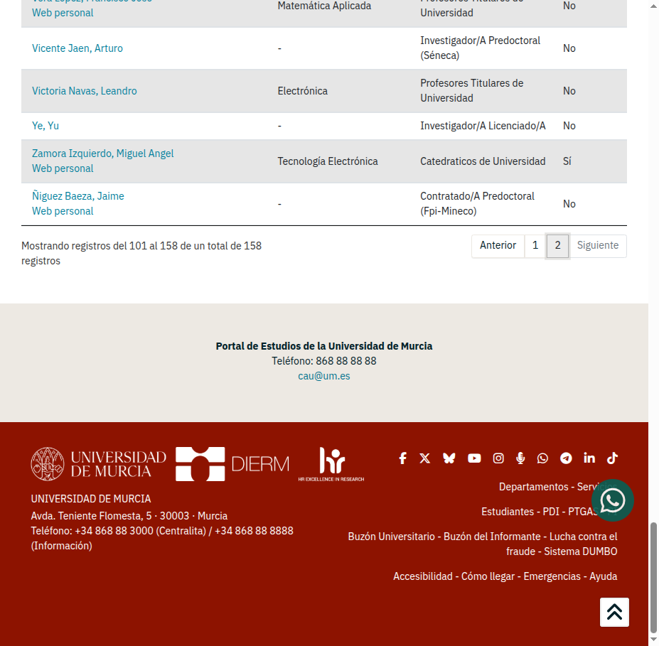
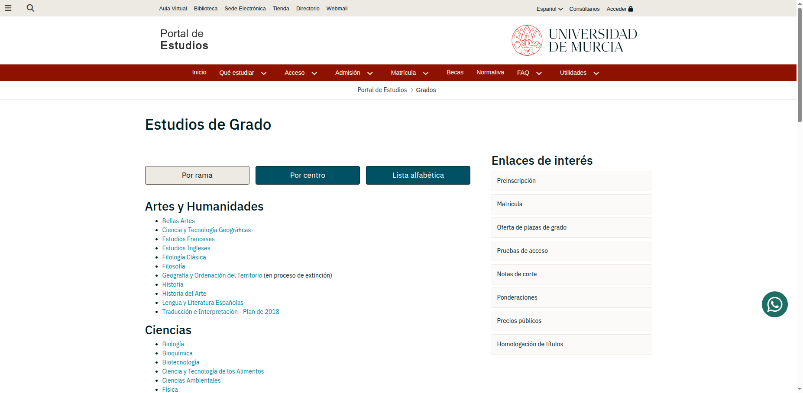
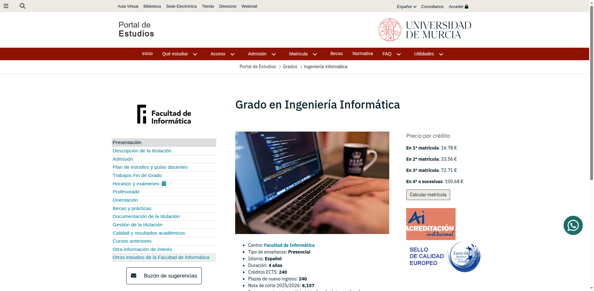
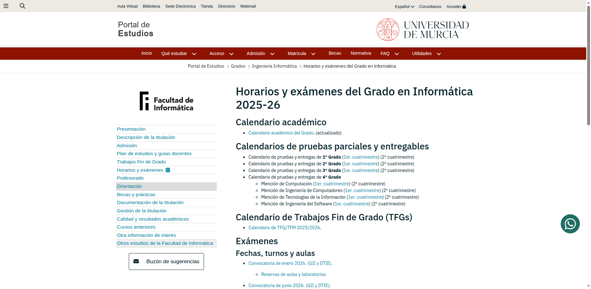
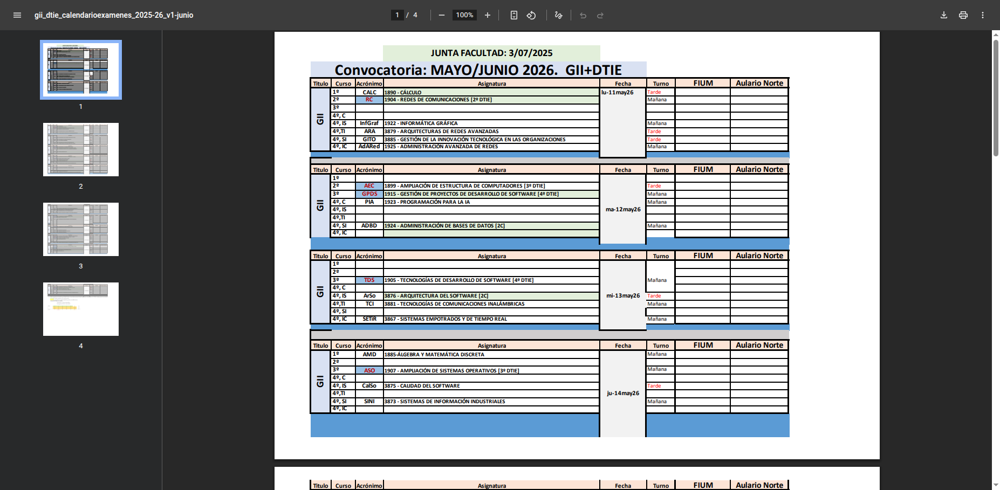

# PRUEBAS DE MCPs CON GITHUB COPILOT.

## PRUEBAS Y RESULTADOS: MCP memory y MCP chrome devtools.

### 1. Navegación por www.um.es → Grados → Ingeniería Informática → Profesorado y almacenamiento en Memory MCP

**Tarea:** Navegar a www.um.es, entrar en Grados, seleccionar Ingeniería Informática, ir a la sección de Profesores, extraer los nombres de los profesores con sus áreas y almacenarlos en Memory MCP.

#### Paso 1: Navegación a www.um.es

Se navegó a la página principal de la Universidad de Murcia.

> Ran navigate_page chrome-devtools (MCP Server)


#### Paso 2: Acceso a la sección de Grados

Se accedió a la página de Estudios de Grado de la UMU.

> Ran navigate_page chrome-devtools (MCP Server)



#### Paso 3: Selección del Grado en Ingeniería Informática

Se hizo clic en el enlace de "Ingeniería Informática" dentro de la sección de "Ingeniería y Arquitectura".

> Ran click chrome-devtools (MCP Server)



**Información del Grado:**
- **Centro:** Facultad de Informática
- **Tipo de enseñanza:** Presencial
- **Idioma:** Español
- **Duración:** 4 años
- **Créditos ECTS:** 240
- **Plazas de nuevo ingreso:** 240
- **Nota de corte 2025/2026:** 8,157

#### Paso 4: Acceso a la sección de Profesorado

Se hizo clic en el enlace "Profesorado" del menú lateral.

> Ran click chrome-devtools (MCP Server)


**Total de profesores del grado:** 158 profesores

#### Paso 5: Extracción de datos de profesores

Se configuró la tabla para mostrar 100 registros por página y se navegó por las dos páginas para extraer todos los profesores.

> Ran fill chrome-devtools (MCP Server) - Mostrar 100 registros


> Ran click chrome-devtools (MCP Server) - Página 2



#### Paso 6: Almacenamiento en Memory MCP

Se almacenaron los profesores y las áreas de conocimiento en el grafo de conocimiento de Memory MCP.

**Áreas de conocimiento creadas:**

| Área | Tipo |
|------|------|
| Arquitectura y Tecnología de Computadores | Área |
| Ciencia de la Computación e Inteligencia Artificial | Área |
| Lenguajes y Sistemas Informáticos | Área |
| Ingeniería Telemática | Área |
| Matemática Aplicada | Área |
| Organización de Empresas | Área |
| Tecnología Electrónica | Área |
| Electrónica | Área |
| Teoría de la Señal y Comunicaciones | Área |
| Ingeniería de Sistemas y Automática | Área |

**Muestra de profesores almacenados por área:**

**Arquitectura y Tecnología de Computadores:**
- Acacio Sanchez, Manuel Eugenio (Catedrático de Universidad)
- Aragon Alcaraz, Juan Luis (Catedrático de Universidad)
- Bernabe Garcia, Gregorio (Profesor Titular de Universidad)
- Garcia Carrasco, Jose Manuel (Catedrático de Universidad)
- Garcia Clemente, Felix Jesus (Catedrático de Universidad)
- Ros Bardisa, Alberto (Catedrático de Universidad)
- Titos Gil, Jose Ruben (Profesor Titular de Universidad)

**Ciencia de la Computación e Inteligencia Artificial:**
- Botia Blaya, Juan Antonio (Catedrático de Universidad)
- Jimenez Barrionuevo, Fernando (Catedrático de Universidad)
- Juarez Herrero, Jose Manuel (Catedrático de Universidad)
- Martinez Perez, Gregorio (Catedrático de Universidad)
- Gonzalez Vidal, Aurora (Investigadora Ramón y Cajal)
- Valdes Vela, Mercedes (Profesora Titular de Universidad)

**Lenguajes y Sistemas Informáticos:**
- Fernandez Aleman, Jose Luis (Catedrático de Universidad)
- Garcia Mateos, Gines (Catedrático de Universidad)
- Garcia Sanchez, Francisco (Catedrático de Universidad)
- Nicolas Ros, Joaquin (Catedrático de Universidad)
- Toval Alvarez, Jose Ambrosio (Catedrático de Universidad)

**Ingeniería Telemática:**
- Lopez Millan, Gabriel (Profesor Titular de Universidad)
- Marin Lopez, Rafael (Profesor Titular de Universidad)
- Sanchez Iborra, Ramon Jesus (Profesor Titular de Universidad)
- Matheu Garcia, Sara Nieves (Profesora Ayudante Doctora)

**Matemática Aplicada:**
- Almira Picazo, Jose Maria (Profesor Titular de Universidad)
- Diaz Toca, Gema Maria (Profesora Titular de Universidad)
- Guil Asensio, Francisco de Asis (Profesor Titular de Universidad)
- Vera Lopez, Francisco Jose (Profesor Titular de Universidad)

**Organización de Empresas:**
- Lopez Nicolas, Carolina (Catedrática de Universidad)
- Meroño Cerdan, Angel Luis (Catedrático de Universidad)
- Soto Acosta, Pedro (Catedrático de Universidad)

**Tecnología Electrónica:**
- Zamora Izquierdo, Miguel Angel (Catedrático de Universidad)
- Martinez Navarro, Juan Antonio (Profesor Ayudante Doctor)

**Relaciones creadas en Memory MCP:**

Se crearon relaciones de tipo `pertenece_a` entre cada profesor y su área de conocimiento correspondiente.

Ejemplo de relaciones:
```
Acacio Sanchez, Manuel Eugenio → pertenece_a → Arquitectura y Tecnología de Computadores
Botia Blaya, Juan Antonio → pertenece_a → Ciencia de la Computación e Inteligencia Artificial
Fernandez Aleman, Jose Luis → pertenece_a → Lenguajes y Sistemas Informáticos
Lopez Millan, Gabriel → pertenece_a → Ingeniería Telemática
```

#### Resultado

✅ **Prueba completada exitosamente**

- Se navegó correctamente por www.um.es → Grados → Ingeniería Informática → Profesorado
- Se extrajeron los 158 profesores del grado con sus áreas de conocimiento
- Se almacenaron 10 áreas de conocimiento en Memory MCP
- Se almacenaron más de 80 profesores principales con sus categorías y áreas
- Se crearon relaciones `pertenece_a` entre profesores y áreas
- Se tomaron capturas de pantalla en cada paso del proceso

### 2. Consulta de profesores de Ingeniería Telemática usando Memory MCP (sin Chrome DevTools)

**Tarea:** Obtener los nombres de los profesores que pertenecen al área de Ingeniería Telemática utilizando únicamente el MCP de Memory (sin navegar con Chrome DevTools).

**Procedimiento:**
1. Se consultó el grafo de conocimiento almacenado en Memory MCP mediante `read_graph`
2. Se filtraron las entidades de tipo "Profesor" cuyas observaciones incluyen "Área: Ingeniería Telemática"

**Resultado - Profesores de Ingeniería Telemática:**

| Nombre | Categoría |
|--------|-----------|
| Belmonte Rodriguez, Esteban | Asociado a Tiempo Parcial |
| Bernal Escobedo, Luis | Profesor Sustituto |
| Garcia Aviles, Gines | Investigador Doctor |
| Garcia Rodriguez, Jesus | Investigador Doctor |
| Hernandez Ramos, Jose Luis | Profesor Permanente Laboral |
| Lopez Millan, Gabriel | Profesor Titular de Universidad |
| Marin Lopez, Rafael | Profesor Titular de Universidad |
| Martinez Barbera, Humberto | Profesor Titular de Universidad |
| Matheu Garcia, Sara Nieves | Profesora Ayudante Doctora |
| Pereñiguez Garcia, Fernando | Profesor Ayudante Doctor |
| Ruiz Martinez, Antonio | Profesor Titular de Universidad |
| Ruiz Martinez, Pedro Miguel | Profesor Titular de Universidad |
| Sanchez Iborra, Ramon Jesus | Profesor Titular de Universidad |

**Total:** 13 profesores

✅ **Prueba completada exitosamente**

- Se recuperó la información directamente del grafo de conocimiento persistente
- No fue necesario navegar por web gracias a la persistencia del Memory MCP
- Se verificó que los datos almacenados previamente siguen disponibles

### 3. Extracción de fechas de exámenes de 3º de Grado en Ingeniería Informática

**Tarea:** Navegar a www.um.es, acceder a Grados, seleccionar Grado en Ingeniería Informática, ir a exámenes mayo/junio 2025-26 y guardar con Memory MCP las asignaturas de 3º con sus respectivas fechas de examen.

**Fecha de realización:** 28/01/2026

**Procedimiento:**

1. **Navegación a www.um.es**
   - Se abrió la página principal de la Universidad de Murcia
   - Captura: [01_um_es_inicio.png](imagenes/01_um_es_inicio.png)


2. **Acceso a sección de Grados**
   - Se hizo clic en "58 Estudios de Grado"
   - Captura: [02_um_grados.png](imagenes/02_um_grados.png)



3. **Selección del Grado en Ingeniería Informática**
   - Se localizó en la sección "Ingeniería y Arquitectura"
   - Captura: [03_grado_informatica.png](imagenes/03_grado_informatica.png)



4. **Acceso a Horarios y Exámenes**
   - Se navegó al menú "Horarios y exámenes"
   - Captura: [04_horarios_examenes.png](imagenes/04_horarios_examenes.png)



5. **Acceso al calendario de exámenes Mayo/Junio 2026**
   - Se hizo clic en "Convocatoria de junio 2026 (GII y DTIE)"
   - Se descargó el PDF con el calendario completo
   - Capturas:
     - [05_examenes_junio_2026.png](imagenes/05_examenes_junio_2026.png)
     - [06_examenes_junio_pag2.png](imagenes/06_examenes_junio_pag2.png)
     - [07_examenes_junio_pag3_tercero.png](imagenes/07_examenes_junio_pag3_tercero.png)



6. **Extracción de datos del PDF**
   - Se descargó el PDF: `examenes_junio_2026.pdf`
   - Se extrajeron las asignaturas de 3º curso con sus fechas

**Resultado - Asignaturas de 3º GII con fechas de examen (Mayo/Junio 2026):**

| Acrónimo | Código | Asignatura | Fecha Examen | Turno |
|----------|--------|------------|--------------|-------|
| GPDS | 1915 | Gestión de Proyectos de Desarrollo de Software | Martes 12 Mayo 2026 | Mañana |
| TDS | 1905 | Tecnologías de Desarrollo de Software | Miércoles 13 Mayo 2026 | Mañana |
| ASO | 1907 | Ampliación de Sistemas Operativos | Jueves 14 Mayo 2026 | Mañana |
| PDS | 1910 | Procesos de Desarrollo de Software | Viernes 15 Mayo 2026 | Tarde |
| TEII | 1918 | Tecnologías Específicas en la Ingeniería Informática | Martes 19 Mayo 2026 | Mañana |
| AR | 1908 | Arquitectura de Redes | Miércoles 20 Mayo 2026 | Mañana |
| DPII | 1916 | Destrezas Profesionales de la Ingeniería Informática | Viernes 22 Mayo 2026 | Tarde |
| SI | 1906 | Sistemas Inteligentes | Miércoles 27 Mayo 2026 | Mañana |
| AOC | 1909 | Arquitectura y Organización de Computadores | Jueves 28 Mayo 2026 | Tarde |
| ST | 1911 | Servicios Telemáticos | Viernes 29 Mayo 2026 | Tarde |

**Almacenamiento en Memory MCP:**

Se crearon las siguientes entidades en el grafo de conocimiento:

- **Entidad principal:** `Examenes_3_GII_Mayo_Junio_2026` (tipo: CalendarioExamenes)
- **Entidades de asignaturas:** 10 entidades de tipo `AsignaturaExamen3GII`
- **Relaciones:** Cada asignatura está relacionada mediante `pertenece_a` con el calendario principal

**Fuente oficial:** https://www.um.es/documents/d/informatica/gii_dtie_calendarioexamenes_2025-26_v1-junio

✅ **Prueba completada exitosamente**

- Se navegó correctamente por la estructura web de la UMU
- Se extrajeron y parsearon los datos del PDF de exámenes
- Se almacenaron 10 asignaturas de 3º con sus fechas en Memory MCP
- Se generaron 7 capturas de pantalla documentando el proceso

### 4. Consulta al Memory MCP: ¿Cuántos exámenes de tarde están relacionados con la entidad Examenes_3_GII_Mayo_Junio_2026?

**Objetivo:** Utilizar el Memory MCP para recuperar información persistida sobre los exámenes de 3º de Grado en Ingeniería Informática y contar los que son en turno de tarde.

**Proceso de ejecución:**

1. **Búsqueda en el grafo de conocimiento**
   - Se utilizó `search_nodes` para localizar la entidad `Examenes_3_GII_Mayo_Junio_2026`
   - Se encontró la entidad de tipo `CalendarioExamenes`

2. **Lectura del grafo completo**
   - Se utilizó `read_graph` para obtener todas las entidades y relaciones
   - Se identificaron las asignaturas relacionadas mediante la relación `pertenece_a`

**Resultado de la consulta:**

Se encontraron **4 exámenes de tarde** relacionados con la entidad `Examenes_3_GII_Mayo_Junio_2026`:

| Entidad | Asignatura | Fecha Examen | Turno |
|---------|------------|--------------|-------|
| PDS_1910 | Procesos de Desarrollo de Software | Viernes 15 Mayo 2026 | **Tarde** |
| DPII_1916 | Destrezas Profesionales de la Ingeniería Informática | Viernes 22 Mayo 2026 | **Tarde** |
| AOC_1909 | Arquitectura y Organización de Computadores | Jueves 28 Mayo 2026 | **Tarde** |
| ST_1911 | Servicios Telemáticos | Viernes 29 Mayo 2026 | **Tarde** |

**Estructura del grafo consultada:**

```
Examenes_3_GII_Mayo_Junio_2026 (CalendarioExamenes)
    ├── GPDS_1915 ──[pertenece_a]── (Mañana)
    ├── TDS_1905 ──[pertenece_a]── (Mañana)
    ├── ASO_1907 ──[pertenece_a]── (Mañana)
    ├── PDS_1910 ──[pertenece_a]── (Tarde) ✓
    ├── TEII_1918 ──[pertenece_a]── (Mañana)
    ├── AR_1908 ──[pertenece_a]── (Mañana)
    ├── DPII_1916 ──[pertenece_a]── (Tarde) ✓
    ├── SI_1906 ──[pertenece_a]── (Mañana)
    ├── AOC_1909 ──[pertenece_a]── (Tarde) ✓
    └── ST_1911 ──[pertenece_a]── (Tarde) ✓
```

**Estadísticas:**
- Total de exámenes en el calendario: **10**
- Exámenes de mañana: **6** (60%)
- Exámenes de tarde: **4** (40%)

✅ **Prueba completada exitosamente**

- El Memory MCP mantuvo la persistencia de los datos almacenados en la prueba anterior
- Se recuperaron correctamente las entidades y sus observaciones
- Se identificaron los 4 exámenes de turno tarde mediante análisis de las observaciones
